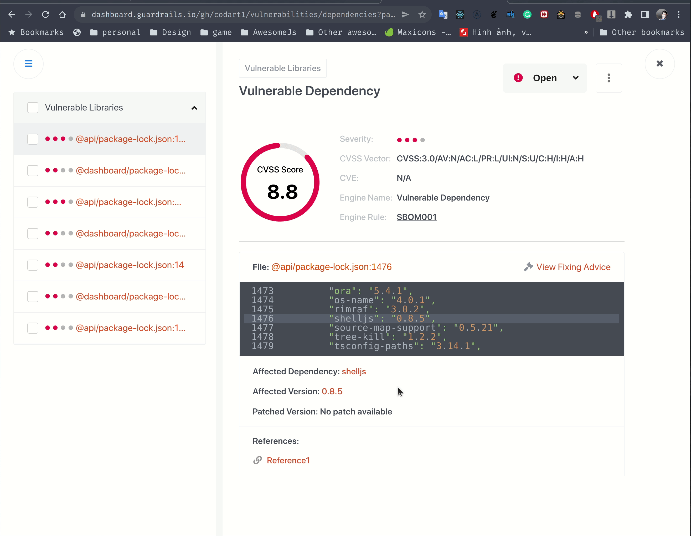
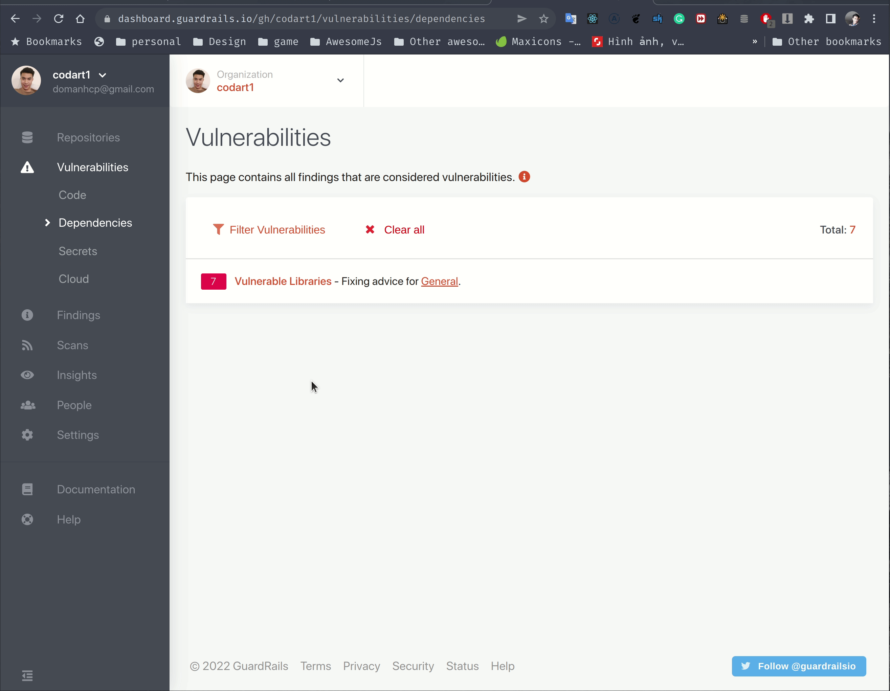
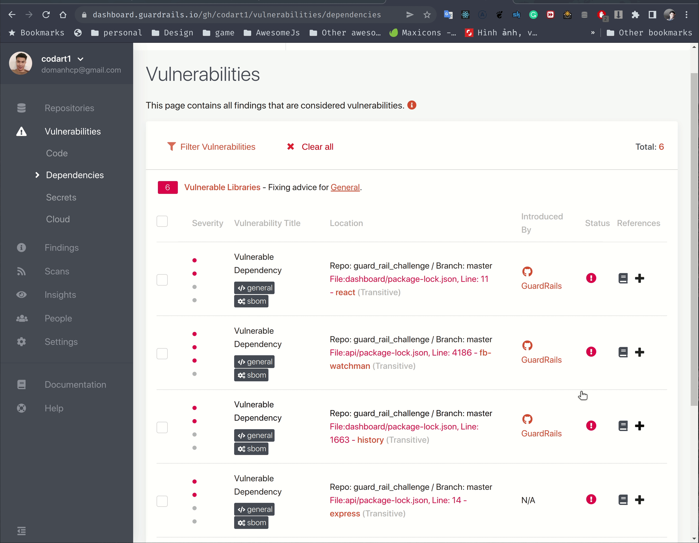

**I tried installing Guardrails to this repository and found some thing that we can improve**

### 1. It's not so clear what the vulnerability mean
And when I click `view fixing advice`, it shows page not found

**My suggestion**: Fix the page not found and include a short description to let user grab the reason behind the vulnerability

### 2. Clicking back doesn't bring user to the original list.
This one is minor but decrease UX a little bit. I click back several times, notice that the url was changed but the UI is not reacted. Eventually, it bring me back to the wrong location (`Findings` instead of `Vulnerabilities`)

**My suggestion**: Clicking back should bring me back to the correct location.

### 3. Create Jira ticket

**My suggestion**: When user click `create jira ticket` button. We should immediately let him know he did not setup the integration yet (Maybe raising a toast is fine). 
Instead of showing the confirmation modal then wait for user to click yes then show the warning like current