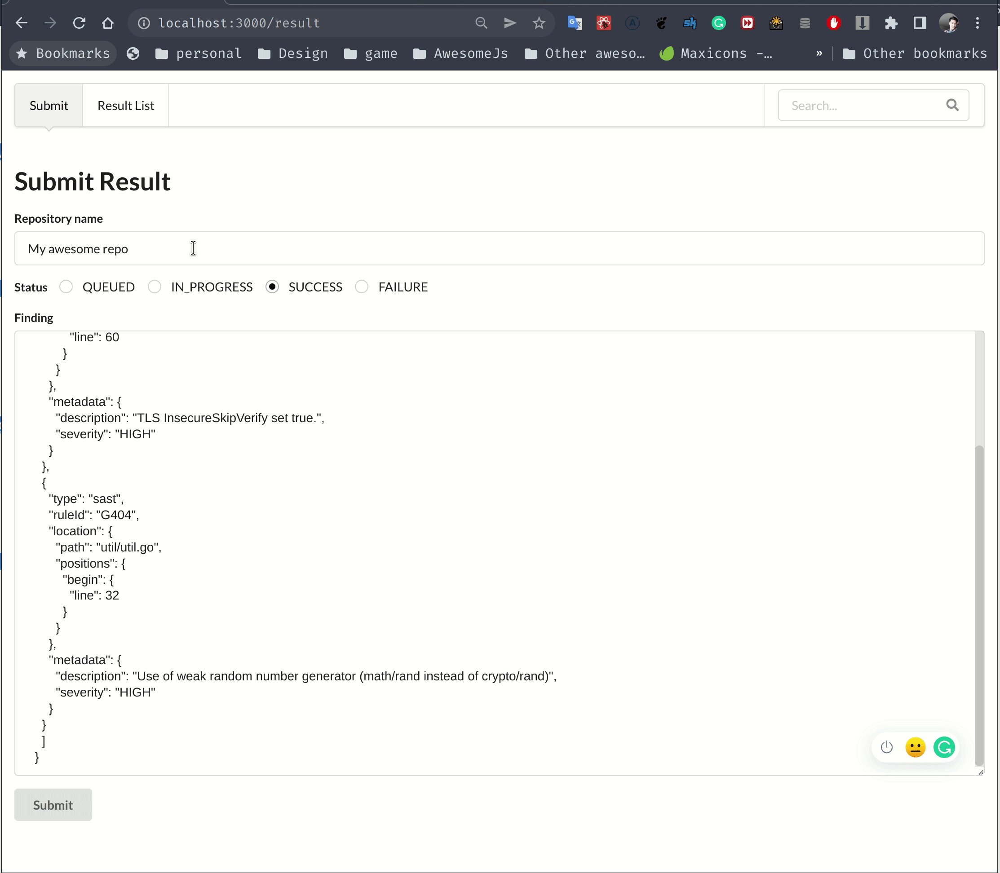
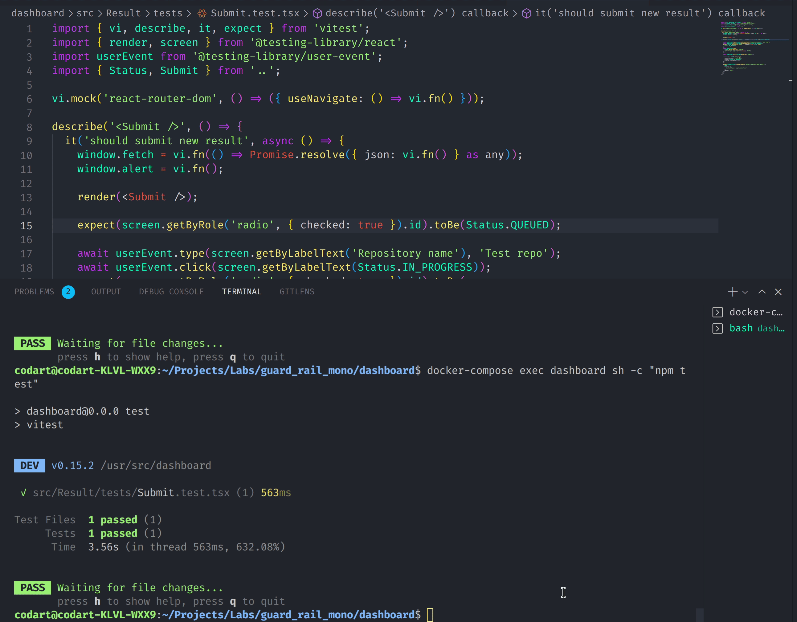

## This is my attempt on the Full Stack engineer challenge by GuardRail

[Link to the original challenge](https://github.com/guardrailsio/full-stack-engineer-challenge)

### How to run

1. Make sure you have `docker` and `docker compose` setup on your machine
2. At project root directory, run `docker-compose up`
3. Run `docker-compose exec api sh -c "npm run db:push && npm run db:seed"` to apply schema and seed mock data
4. open `http://localhost:3000/` and start testing
  
### screenshots

  

### Run test
`docker-compose exec dashboard sh -c "npm test"`

### Tech stack overview   

**Devops**
- Define the whole stack using docker compose so the development env is consistent across machines
- For deployment, separated Dockerfile which uses multi stages build is needed (Not covered in this repo)

**Backend**:
- NestJS - an opinionated web framework which embraces typescript and dependency injection. Helping us to organize code and scale better.
- Prisma - not only an ORM but also generate a type-safe client sdk so we can get the most out of typescript
- No graphql, just ordinary REST endpoint for simplicity
- No foreign input validation to keep it simple, in reality, we should validate all input, for both backend and frontend

**Frontend**
- Vite instead of CRA for development because it's faster by leveraging es-module, while CRA will be slower as the code base grows
- Semantic UI React - Nice and clean UI without much effort, personally I prefer Chakra UI but this is the challenge's requirement.
- `useSwr` for simple fetching and local state caching
- Testing: `vitest` framework, `react-testing-library` to test closely to how our user interact with the UI, avoid testing implementation detail.
- React router
- No form helper, just bare React's state management primitive
- No form validation for simplicity as said

